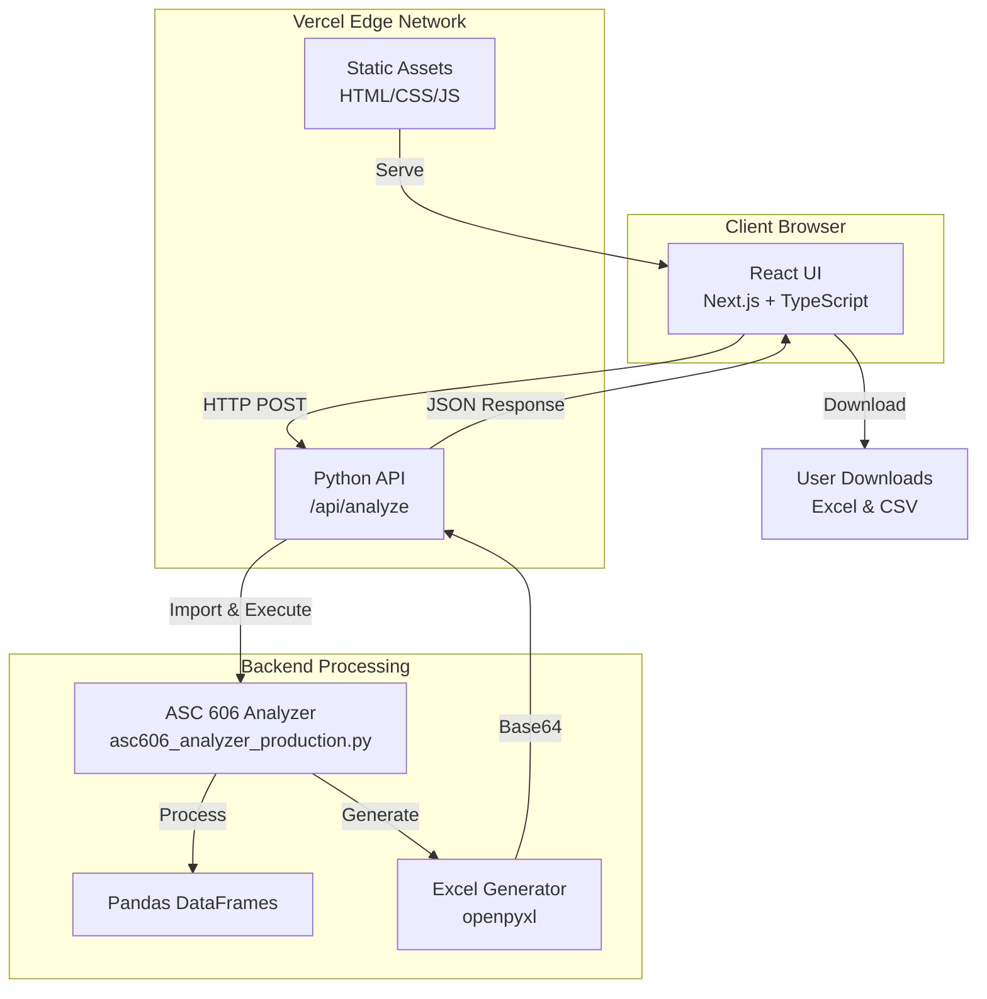

# 🏗️ Architecture Overview

## System Architecture



## Data Flow

```
┌─────────────────────────────────────────────────────────────┐
│ 1. User Input                                               │
│    • Paste contract JSON                                    │
│    • Set discount rate & license %                          │
│    • Click "Analyze"                                        │
└─────────────────┬───────────────────────────────────────────┘
                  │
                  ▼
┌─────────────────────────────────────────────────────────────┐
│ 2. Frontend Validation                                      │
│    • Parse JSON                                             │
│    • Validate structure                                     │
│    • Build API request                                      │
└─────────────────┬───────────────────────────────────────────┘
                  │
                  ▼
┌─────────────────────────────────────────────────────────────┐
│ 3. API Request (POST /api/analyze)                          │
│    {                                                         │
│      contract_data: {...},                                  │
│      discount_rate: 0.06,                                   │
│      license_pct: 0.20                                      │
│    }                                                         │
└─────────────────┬───────────────────────────────────────────┘
                  │
                  ▼
┌─────────────────────────────────────────────────────────────┐
│ 4. Python Serverless Function                               │
│    • Receive request                                        │
│    • Extract parameters                                     │
│    • Instantiate ASC606FinancingAnalyzer                    │
└─────────────────┬───────────────────────────────────────────┘
                  │
                  ▼
┌─────────────────────────────────────────────────────────────┐
│ 5. Core Calculations                                        │
│    • Calculate present value                                │
│    • Determine financing component                          │
│    • Allocate to License/Support                            │
│    • Generate amortization schedules                        │
│    • Create journal entries                                 │
└─────────────────┬───────────────────────────────────────────┘
                  │
                  ▼
┌─────────────────────────────────────────────────────────────┐
│ 6. File Generation                                          │
│    • Export to Excel (in-memory buffer)                     │
│    • Export to CSV (in-memory buffer)                       │
│    • Encode as Base64                                       │
└─────────────────┬───────────────────────────────────────────┘
                  │
                  ▼
┌─────────────────────────────────────────────────────────────┐
│ 7. API Response                                             │
│    {                                                         │
│      success: true,                                         │
│      results: {...},                                        │
│      excel_file: "base64...",                               │
│      csv_file: "base64..."                                  │
│    }                                                         │
└─────────────────┬───────────────────────────────────────────┘
                  │
                  ▼
┌─────────────────────────────────────────────────────────────┐
│ 8. Frontend Rendering                                       │
│    • Display results                                        │
│    • Format numbers                                         │
│    • Highlight significant values                           │
│    • Enable download buttons                                │
└─────────────────┬───────────────────────────────────────────┘
                  │
                  ▼
┌─────────────────────────────────────────────────────────────┐
│ 9. User Downloads                                           │
│    • Decode Base64                                          │
│    • Create Blob                                            │
│    • Trigger browser download                               │
│    • Save Excel & CSV files                                 │
└─────────────────────────────────────────────────────────────┘
```

## Component Breakdown

### Frontend Components

```
app/page.tsx
├── ContractInput
│   ├── JSON Textarea
│   ├── Example Loader Button
│   ├── Discount Rate Input
│   └── License % Input
│
├── AnalyzeButton
│   ├── Loading State
│   └── Disabled State
│
├── ResultsDisplay
│   ├── Summary Metrics
│   │   ├── Stated Total
│   │   ├── Present Value
│   │   ├── Financing Component
│   │   └── Significance Flag
│   │
│   ├── Revenue Allocation
│   │   ├── License Section
│   │   └── Support Section
│   │
│   └── Download Buttons
│       ├── Excel Download
│       └── CSV Download
│
└── Instructions
    ├── How to Use
    └── JSON Format Example
```

### Backend Components

```
api/analyze.py (handler)
├── Request Parsing
├── Parameter Extraction
├── ASC606FinancingAnalyzer
│   ├── __init__
│   ├── calculate_present_value()
│   ├── allocate_to_obligations()
│   ├── generate_amortization_schedule()
│   ├── generate_journal_entries()
│   ├── export_to_excel_buffer()
│   └── export_journal_entries_buffer()
├── Base64 Encoding
└── Response Formation
```

## Technology Choices & Rationale

| Technology | Why Chosen |
|-----------|-----------|
| **Next.js 14** | Modern React framework, excellent Vercel integration, App Router for better performance |
| **TypeScript** | Type safety prevents runtime errors, better IDE support, self-documenting code |
| **Tailwind CSS** | Rapid UI development, consistent design, no CSS file management |
| **Python 3.9** | Existing calculation code, pandas ecosystem, Vercel support |
| **Serverless Functions** | Auto-scaling, pay-per-use, zero infrastructure management |
| **Vercel** | Optimized for Next.js, global CDN, zero-config deployment |
| **In-Memory Processing** | No database needed, stateless, fast, GDPR-friendly |
| **Base64 Transfer** | Simple file transfer over JSON, no temporary storage |

## Performance Optimization

### Frontend
- ✅ Static generation where possible
- ✅ Code splitting (automatic with Next.js)
- ✅ Lazy loading of results
- ✅ Tailwind CSS purging (production)
- ✅ Image optimization (if added later)

### Backend
- ✅ In-memory file generation (no disk I/O)
- ✅ Efficient pandas operations
- ✅ Buffer-based exports
- ✅ No database queries
- ✅ Serverless cold start optimization

### Network
- ✅ Global CDN distribution
- ✅ HTTP/2 by default
- ✅ Gzip/Brotli compression
- ✅ Edge caching of static assets

## Scalability

| Aspect | Capability |
|--------|-----------|
| **Concurrent Users** | Unlimited (serverless auto-scales) |
| **Requests/Second** | 100+ on free tier, 1000+ on Pro |
| **Data Processing** | Limited by 10s timeout (free) or 60s (Pro) |
| **Storage** | None required (stateless) |
| **Cost at Scale** | ~$0.20 per 1000 calculations (free tier: 100k/month) |

## Security Model

```
┌─────────────────────────────────────────────────────────┐
│ Client Browser (User)                                   │
│ • HTTPS enforced                                        │
│ • No sensitive data stored locally                     │
└────────────────────┬────────────────────────────────────┘
                     │ TLS 1.3
                     ▼
┌─────────────────────────────────────────────────────────┐
│ Vercel Edge Network                                     │
│ • DDoS protection                                       │
│ • Rate limiting                                         │
│ • SSL certificates                                      │
└────────────────────┬────────────────────────────────────┘
                     │ Internal
                     ▼
┌─────────────────────────────────────────────────────────┐
│ Serverless Function                                     │
│ • Isolated execution environment                       │
│ • No persistent state                                  │
│ • Input validation                                     │
│ • Error handling                                       │
└────────────────────┬────────────────────────────────────┘
                     │ In-Memory
                     ▼
┌─────────────────────────────────────────────────────────┐
│ Calculation Engine                                      │
│ • Pure computation                                     │
│ • No external calls                                    │
│ • No data logging                                      │
└─────────────────────────────────────────────────────────┘
```

### Security Features
- ✅ No database (no data breach risk)
- ✅ No authentication (but can be added)
- ✅ HTTPS everywhere
- ✅ No logging of contract data
- ✅ Serverless isolation
- ✅ Input validation
- ✅ CORS headers configured
- ✅ Rate limiting (Vercel default)

## Deployment Pipeline

```
Local Development → Git Push → GitHub → Vercel → Production
      ↓
   npm run dev
      ↓
   localhost:3000
```

**Automated CI/CD:**
1. Push to `main` branch
2. Vercel detects change
3. Runs build process
4. Deploys to production
5. Updates live site
6. Sends deployment notification

## Monitoring & Observability

### Built-in (Vercel)
- ✅ Function execution logs
- ✅ Performance metrics
- ✅ Error tracking
- ✅ Bandwidth usage
- ✅ Request counts

### Can Add Later
- [ ] Custom analytics (Plausible, Fathom)
- [ ] Error monitoring (Sentry)
- [ ] User session replay (LogRocket)
- [ ] Performance monitoring (Lighthouse)

---

This architecture provides a solid foundation that's:
- ✅ Production-ready
- ✅ Scalable
- ✅ Maintainable
- ✅ Secure
- ✅ Cost-effective
